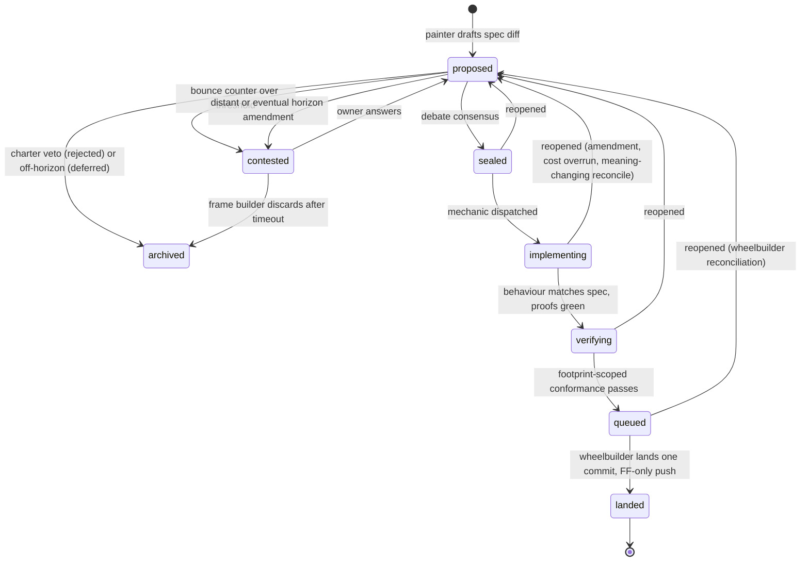

# Shed design doc

A spec-driven software factory that runs itself on a plain git repository, with debate at its centre. Successor to kpenfound/busybees

Status: draft v0.3. Nothing here is implemented yet.

---

## 1. Purpose

Shed is a software factory, a system of AI agents that plans, builds, verifies, and ships software with almost no human involvement.

The premise is that most feature ideas come from inside the factory, not from a person. The human writes down what the project is for and what it must never do, describes where the project should eventually go, and now and then asks for something specific. The agents do the rest. They decide what to build next, argue about whether it is a good idea, write it, test it, review it, and merge it.

Because the ideas come from inside, the factory does not need an external issue tracker or a hosted code platform. It runs on a git repository and a small amount of local state.

### 1.1 Why a shed

The name comes from C. Northcote Parkinson's law of triviality. His finance committee approved a nuclear reactor in minutes, because nobody understood it well enough to object, then spent an hour on a bicycle shed, because everyone had an opinion about sheds. Software borrowed the word, and bikeshedding has meant wasted debate ever since.

This system makes that debate its core operation rather than its friction, because three things about debate have changed.

It is cheap. A round of debate is a handful of model calls. It can run at every stage of a change instead of once at the start.

It repeats without social cost. A human team cannot reopen a settled decision ten times. People tire, get defensive, and treat reopening as an attack on whoever settled it. Agents carry none of that. This is what turns "any stage can send a change back" and "acceptance is not a promise" from organisational suicide into ordinary rules.

The debaters are as competent on the reactor as on the shed. Parkinson's committee argued about the shed because it was the only thing they understood. Model committee members understand both, so the debate finally happens where it matters. His problem was never the cost of debate. It was where the debate landed.

Cheap debate is necessary and not sufficient. Without a termination rule it becomes infinite debate. With agreeable debaters it becomes expensive rubber-stamping. The deterministic machine around the shed exists to handle both, and most of this document describes that machine.

### 1.2 The shape of the design

The design turns on one choice. A written description of the software's behaviour is committed next to the code, and a proposed change to that description is the unit of work. A feature starts as an edit to the description. It goes to the shed. Then it gets implemented until the software does what the description says. Only then does it merge, as one piece, never in fragments. The description and the code on the main branch always agree.

Three committed documents give the factory direction and limits. One states purpose and boundaries and only the human may change it. One describes current behaviour. One describes the intended future. The gap between the last two is the backlog.

The rest of this document defines the vocabulary, the documents, the life of a change, the roles that carry it out, the scheduler, and the version control model.

---

## 2. Vocabulary

Concepts get neutral names, with one exception. Debate is called the shed, because it is the centre of the system and "back to the shed" is clearer than any neutral phrase. Roles get names from a bike workshop. Don't mix the two sets.

### 2.1 Concepts

|Term|Meaning|
|---|---|
|charter|The project's purpose and boundaries. Immutable, human-owned, written before anything else.|
|spec|Documents describing what the software on main does and what it must not do. Every clause has a stable ID.|
|proofs|The executable half of the spec. Tests that show a clause is satisfied.|
|horizon|The desired future state, tiered by how close it is to the spec. The measure every proposal is judged against.|
|change unit (unit)|One spec diff with its proofs, implementation, footprint, seal, and bundle, on its own branch. The thing that lands.|
|footprint|The spec clauses a unit modifies or depends on (spec footprint), and the horizon clauses it advances (horizon footprint).|
|seal|The triple `(main commit, unit change ID, unit commit)` recorded when a unit's spec is accepted. Moves on reconcile.|
|bundle|The context handed to every session on a unit. Sealed spec, proofs, footprint, debate record, notes, pending notices.|
|formula|The DAG of implementation steps for a unit type, such as tdd, then api, then docs. Data, not code.|
|archive|What the factory decided not to do, on two shelves. Rejected means it violated the charter. Deferred means it was clean but off the horizon.|
|milestone|A named bundle of soon-tier horizon clauses. No dates.|
|tracker|Derived, fast-changing state. Unit states, seals, footprints, bounce counters, event log. Lives beside the repo.|
|the shed|Debate. Where every proposal, amendment, and reopened unit goes. "Back to the shed" means reopened.|
|reconcile|The pass run after every landing and every horizon change that rebases in-flight units onto the new truth.|
|entanglement|Two in-flight units whose footprints intersect.|

### 2.2 Roles

|Role|Job|
|---|---|
|owner|The human. Owns the charter, vetoes horizon changes after the fact, answers contested units and charter questions. Rarely in the shed. Blocks nothing except charter ratification.|
|frame builder|Direction. Owns the horizon, breaks it into footprint-sized increments, accepts near and soon tier amendments, discards contested units. The horizon is the frame everything else bolts onto.|
|painter|Writes proposals. Reads the gap between horizon and spec, and the deferred shelf. Drafts spec diffs and amendments. The one who walks in and says "let's paint it green".|
|committee|Adversarial reviewers. Review specs in the shed and code in verification. One role shape, two prompts. Cite clause IDs. Plural by nature, because they run in parallel.|
|mechanic|Implements a sealed unit until behaviour matches spec, walking the formula. May request amendments.|
|wheelbuilder|Runs the merge queue and reconciliation. Laces units into main and trues the wheel afterwards. Orders the queue, lands units, rebases in-flight work, resolves conflicts against the sealed spec, flags entanglement. Also acts inside a unit when steps run in parallel.|
|sweeper|The broom wagon. Patrols main for spec violations and files them. Runs spec extraction on an existing codebase.|

---

## 3. Design principles

### 3.1 The bets

1. The spec is the tracker. A unit is a spec diff plus the proofs and code that satisfy it. No separate issue system holds the meaning.
2. Units land whole. A unit is one behavioural increment and lands on main all at once. Main is always spec-conformant.
3. Work is sized by footprint, not by implementation cost.
4. The outer machine is deterministic Go. States, transitions, footprint math, queue ordering, seals, and reconcile are code. The steps inside a unit are data.
5. The shed is the hub. Any stage can send a unit back to it. Acceptance is not a promise.
6. The human is asynchronous and never a blocker, with one exception, charter amendments.
7. Autonomy lives in a document, not in the software. The charter sets how loose or strict the factory is. Same binary, any posture.
8. Git holds content, not workflow state. Everything semantic sits above it.

### 3.2 Three clocks

The three committed documents change at very different speeds.

|Document|Moves at|Moved by|
|---|---|---|
|spec|factory speed, hours|the factory, by landing units|
|horizon|review speed, days to weeks|frame builder proposes, owner vetoes after the fact|
|charter|project lifetime|owner only|

Each document shields the one below it from the one above. The human works on the two slow ones. That is why this does not feel like supervision even though the human keeps control.

---

## 4. Documents

All four live in the repository with the code.

### 4.1 Charter

Purpose and boundaries, in about a page of clauses, each with a stable ID. It should say what the project is not as plainly as what it is, so that scope creep is a citable violation rather than a feeling.

The charter never changes without human ratification (§10). It constrains every artifact, not only the spec. A committee member checks it at proposal time and again at code review, because a proposal can be clean while its implementation is not. "No network calls" is a charter clause that only code review can enforce.

Keep factory configuration out of it. Budgets, concurrency, models, round caps are operator settings. If they leak into the charter, agents start debating whether "max 3 mechanics" is a principle, and the charter stops being a pure statement of purpose.

The charter comes first. If it cannot be written in a page of citable clauses, debate has nothing to cite and the veto turns into opinion.

### 4.2 Spec

Descriptive documents of current behaviour and constraints, implemented in code and demonstrated by proofs.

Clause IDs are not optional. Footprint computation, conformance checking, entanglement detection, and queue ordering all reduce to set operations on clause IDs. Without IDs every one of those becomes an LLM judgment on every pair, every time, and the cost of running the factory climbs with the square of the work in flight.

The spec has two forms. Prose carries intent. Proofs carry the executable check. A spec diff yields the affected clauses mechanically, and each affected clause must map to at least one proof.

Only a landing changes the spec on main. Nothing edits it directly. This is what gives you the invariant that main is always spec-conformant. No half-features, no feature flags hiding unfinished work, no drift between what the document says and what the code does.

### 4.3 Horizon

The desired future state, written at varying precision and tiered by how close each clause is to the spec. Not by date. Dates lie; distance from the spec does not.

|Tier|Meaning|Churn|Approval for amendments|
|---|---|---|---|
|near|Clauses being sharpened into spec clauses right now. In-flight units cite them.|high, expected, mostly additive|auto-accept on debate consensus|
|soon|Precise enough to propose against. Nothing in flight yet.|moderate|zero dissent accepts; a split waits for the owner|
|distant|Intent level. Needs sharpening before a painter can footprint it.|low|always waits for the owner|
|eventual|Vision statements that never fully resolve.|very low|always waits for the owner|

Clauses promote toward the spec through the tiers. One horizon clause becomes several spec clauses over time, so "how much of horizon clause H is realised" is measurable, and that number is the progress meter.

The backlog is `diff(horizon, spec)`. Painters pick a region of the gap. When the gap is empty the factory idles, which is a legitimate state, until the frame builder moves the horizon. Sweepers keep patrolling either way.

Horizon amendments go through debate like everything else. The approval policy depends on the tier, per the table. An operator can require owner approval for every tier if they want.

Certainty means dissent count, never self-reported confidence. "Zero committee members objected after three rounds" is observable. "We are 90% sure" is not, and agents are reliably overconfident, so never let them grade their own certainty.

Some auto-accepted amendments should reach the owner anyway. Sample a configurable fraction so the threshold gets calibrated against actual human disagreement instead of being trusted forever.

Near-tier churn follows the same rule as spec reconcile. An amendment that adds detail to a clause an in-flight unit cites notifies the mechanic and the unit keeps going. An amendment that changes the meaning of that clause reopens the unit.

Drift is the risk. Agents co-author the horizon, so there is a pull toward wherever the work is easy. The charter is the anchor and the owner's veto is the check. Tell the committee to watch for the disguised case, a near-tier amendment that would change which distant clause it descends from. That is a distant-tier change and follows distant-tier rules.

Milestones are named bundles of soon-tier clauses. No dates, no ceremony. A milestone is done when every clause in it has been realised on main.

A painter who thinks a deferred archive item's time has come proposes promoting it onto the eventual tier. That is an ordinary horizon amendment. The archive and the horizon stop being two separate places for "not now".

An optional settling period is available as operator config. Horizon changes cannot justify a proposal until they are N days old, so the owner sees every change before a unit built on it can land. Tier-based approval probably makes it redundant, but it is cheap to keep.

### 4.4 Archive

Two shelves, in the repo, in a directory painters can read rather than a table they have to query. An orphan branch or a small tracking repo both work.

Rejected entries violated the charter. Each records the citation. Their main job is to stop the same idea from being re-proposed.

Deferred entries were clean but off the horizon. Each records what would change the decision. Painters re-read this shelf whenever the horizon moves.

Declined charter and horizon amendments go here too. An entry lists the horizon clauses its proposal added, changed or removed, with their tags and text before and after, beside its spec changes and debate.

---

## 5. Change units

A change unit is one whole behavioural increment. A spec diff, the proofs that demonstrate it, and the implementation that satisfies it, on one jj change, which is a branch in git terms.

### 5.1 Atomicity

A unit lands on main as one commit, however large it is and however much it cost to build. Never in pieces.

This does not eliminate decomposition. It moves it upstream. Scrum breaks work apart after design, and the pieces are individually meaningless: "add the column", "wire the endpoint". Here the frame builder breaks the spec apart before implementation, and each piece is a coherent behavioural increment. Decomposition happens where the semantic boundaries are.

The cost is long-lived branches, the thing the industry gave up on because of merge hell. Three things make them workable here. The reconcile loop keeps a unit's spec current continuously rather than at merge time. Agents absorb a re-seal cheaply where a human team would groan. Footprints make most landings a no-op for most units. If footprints turn out to be routinely large, this becomes merge hell with extra steps. That is the bet, and I would rather name it than pretend it away.

What you lose is incremental user feedback on a half-built feature. The frame builder compensates by proposing the smallest useful spec as its own unit first, then follow-on increments. Incremental delivery, done at the spec layer.

### 5.2 Footprint

Two footprints per unit, computed at sealing and recomputed on reconcile.

The spec footprint is the clause IDs the unit modifies plus the ones it depends on. It says what changes. The horizon footprint is the horizon clause IDs the unit advances. It says why.

Size is measured in footprint, not tokens. A unit that costs $400 and touches three clauses is safe. A unit that costs $40 and touches thirty is dangerous, because it is entangled with everything and will be reopened every time a neighbour lands. When the frame builder says a proposal is too big, the split she demands is by footprint. Exposure time multiplied by footprint is the risk. Implementation cost barely matters to atomicity.

### 5.3 Seal

Recorded at acceptance as `(main commit hash, unit change ID, unit commit hash)`. A merge base, not a single hash. The unit commit pins the unit's spec as it was accepted, so a reseal after an amendment can tell the mechanic exactly what the amendment changed. When main moves, every in-flight seal is stale by definition and reconcile (§9) updates it. jj change IDs survive rebases, so tracker references never dangle.

### 5.4 Bundle

The scheduler assembles it before every session on the unit. Sealed spec, proofs, footprint, debate record, unit notes, and any pending notices such as "seal moved", "horizon clause sharpened", or "conflict markers present in these files". The bundle is what makes ephemeral sessions cheap enough to keep.

### 5.5 Parallelism inside a unit

One mechanic working a large sealed spec serially is slow. The formula is a DAG, so steps whose dependencies are met run at the same time in separate jj workspaces branching from the unit change. A wheelbuilder scoped to the unit squashes them back in. Same roles, one level down. The unit is atomic to main; inside, it is a small factory.

### 5.6 Cost is a signal, not a cap

A unit's cost is unbounded by design, so an overrun means something other than "stop". It means "this is costing three times the estimate, is the spec wrong?" Route it to `reopened`. Maybe the spec was underspecified, maybe the footprint estimate was off. Debate is the right place to find out. A per-session cap still exists to protect the infrastructure.

---

## 6. State machine

### 6.1 States

```
proposed -> sealed -> implementing -> verifying -> queued -> landed
    ^_____________________________________________|
                  reopened (from anywhere)

terminals: archived (rejected | deferred), contested, landed
```



|State|Meaning|Handled by|
|---|---|---|
|proposed|A spec diff exists on its own change and is in the shed. The hub.|painter and committee|
|sealed|Debate reached consensus. Seal recorded, footprints computed, entanglement advisory issued. Waiting for a mechanic.|scheduler, wheelbuilder|
|implementing|Mechanics walk the formula until behaviour matches spec.|mechanic|
|verifying|Every affected clause has a proof, all proofs pass, an independent committee member reads spec against behaviour, the charter is checked against the code.|committee member, sweeper|
|queued|In the merge queue. Wheelbuilders rebase onto main, resolve conflicts against the sealed spec, order by entanglement.|wheelbuilder|
|landed|One commit on main. Terminal. Triggers reconcile.|wheelbuilder|
|reopened|Not a resting state. The universal return edge, or "back to the shed". Any role may send a unit back to `proposed` with a written reason. Increments the bounce counter.|any|
|contested|Bounce counter over threshold, or a distant or eventual horizon amendment awaiting approval. Raised to the owner without blocking. The frame builder may discard after a timeout.|owner, frame builder|
|archived|Terminal. Rejected or deferred, with reasons.|none|

### 6.2 A shed, not a pipeline

Any step can push back on the spec. Constraints show up during implementation that nobody could see earlier, and a spec author who could hold enough context to foresee them all might as well write the code. So the machine is a wheel with the shed at the hub and `proposed` as its resting state.

A pipeline halts by construction. A hub does not, so two mechanisms guarantee termination. Every `reopened` increments a per-unit bounce counter, and past a threshold the unit goes `contested`. Shed rounds are capped by `max_shed_rounds`. The bounce counter doubles as a quality signal. High counts point at weak proposals or weak committee members.

### 6.3 Acceptance is not a promise

A sealed unit can be reopened, changed, or discarded from any later stage. There is no `withdrawn` state because nothing was promised. Reconcile (§9) handles supersession. If a later landing changes the meaning of a clause a sealed unit depends on, that unit reopens.

### 6.4 Bugs

A bug is a mismatch between spec and behaviour on main, found by an sweeper on patrol. If the spec is wrong, it becomes a normal unit and goes to debate. If the code is wrong, it skips debate and enters `implementing` directly against the existing sealed spec, with the violated clauses as its footprint. Nobody designed a bug path. The spec provides one.

---

## 7. The shed

The shed is where debate happens, and it is the hub. It runs for spec proposals, horizon amendments, the wording of charter amendments, amendment requests from implementation, and reopened units.

It applies two separate tests. Charter compliance is a veto. If any committee member cites a charter clause the proposal violates, the proposal dies. No quorum needed. It goes to the rejected shelf. Horizon alignment is a direction test. Does this move the spec toward the horizon? A clean proposal that does not is deferred, not rejected, with a note about what would change the answer.

Every debate weighs the spec footprint. Too large, and the frame builder demands a split by footprint rather than by cost.

Committee members run in parallel on the same version of the proposal and collect their objections. The proposer answers once per round. Rounds are capped. Consensus means zero dissent after the cap, not a vote and not a confidence score.

Every debate is recorded in the unit's bundle, and in the archive if the unit ends there.

Amendment requests from implementation (§8.3) take a fast lane. Same rules, shorter round cap, scoped to the sealed spec.

The committee in the shed and the committee in code review are one role with two prompts. Both are adversarial, both are bounded, both cite clause IDs.

---

## 8. Implementation

### 8.1 Formula

The steps inside `implementing` are data. A DAG per unit type with `needs` edges, declared in operator config, walked by mechanics, editable without rebuilding the factory. The states around the formula stay in Go.

### 8.2 Proofs first

Because "behaviour matches spec" drives the whole workflow, the natural formula is spec, then proofs, then implementation. Proofs are the executable spec. Writing them tends to sharpen the prose, and when the sharpening changes meaning, that is an amendment (§8.3).

### 8.3 Amendment path

Implementation always finds the spec was ambiguous or wrong somewhere. Without a path for that you get either silent deviation or stuck work.

A mechanic sends `implementing -> reopened(amendment)`. The unit re-enters `proposed` in the fast lane, scoped to the sealed spec. If the amendment is accepted, the spec is revised, a new seal is recorded, and the unit returns to `implementing` with the mechanic notified of the diff. If it is rejected, the mechanic implements as written or the unit is discarded.

Track amendment count per unit. It is the best signal available of proposal quality and committee quality.

### 8.4 Sessions

Ephemeral `claude -p` sessions, never long-lived. Each one gets the bundle (§5.4) and a plain directory of files. Notices arrive between sessions, never mid-session. Implementation is chunked into steps small enough that a seal change landing between steps costs little.

Sessions never hold the version control tool (§13.4).

---

## 9. Verification, landing, and reconciliation

### 9.1 Verifying

Verification is scoped to the footprint, so it scales with what changed rather than with how much work was done. A unit that rewrites half the codebase to satisfy three clauses is verified against three clauses.

Every affected clause maps to at least one proof. All proofs pass. An independent committee member reads the spec against the behaviour. The charter is checked against the code, because a clean spec can have a dirty implementation. On failure the unit reopens with the failing clause IDs, or goes back to `implementing` if the spec itself is not in question.

### 9.2 The merge queue

Wheelbuilders own it. Main advances one commit at a time, but the queue is not first-in-first-out.

Wheelbuilders order it to minimise entanglement churn. Units with disjoint footprints land in any order at zero propagation cost, so batch them. Among entangled units, land the smaller footprint first so the larger one absorbs a small delta rather than the reverse.

Code rebase and conflict resolution happen here, with the sealed spec in hand. That lets wheelbuilders resolve conflicts on meaning, because the spec says what the behaviour is supposed to be. A textual merge cannot do that.

Landing squashes the unit to one commit on main. The commit message is generated from the seal and the spec diff. The push is fast-forward only, under the wheelbuilder identity.

### 9.3 Reconcile on landing

A landing propagates. Main's spec is the only truth, and reconciliation means rebasing each in-flight unit's sealed spec onto the new main. A reconciled spec is just the merged spec on a unit that has not landed yet. It is the same operation whether that unit is next in the queue or was sealed an hour ago.

Wheelbuilders run the pass over every unit from `sealed` through `queued`.

|Footprint relationship to the landed unit|Outcome|Cost|
|---|---|---|
|disjoint|re-seal mechanically, tell nobody|free, one set intersection|
|overlaps, but the landing only added clauses or context|re-seal, notify the mechanic with the diff and which proofs are now suspect|one notice|
|the landing changed the meaning of a clause this unit depends on|reopen, with the conflict written up by the wheelbuilder|one debate|

The same three outcomes apply one level up when the horizon changes (§4.3), using horizon footprints.

### 9.4 Eager rebase, lazy resolution

With jj (§13), code is also rebased eagerly on every landing. Conflicts are stored inside the commit instead of blocking. `jj log -r 'conflicts()'` then answers "which units have code entanglement" deterministically, the twin of footprint intersection. A unit carrying a stored conflict keeps being implemented. A wheelbuilder resolves it at the queue, or a formula step handles it earlier if mechanics keep tripping over the markers.

### 9.5 Early entanglement advisory

Footprints exist from the moment a unit is sealed, so wheelbuilders can flag "B and C are entangled" before either has spent a token on implementation. It is the same intersection as at landing, run earlier, for free. If the entanglement is bad enough, a painter can propose merging the two units while both are still cheap to change. This is advisory. Wheelbuilders remain the authority at landing.

### 9.6 No stacked units, for now

A unit that depends on another unsealed unit's spec is a coordination mess. It waits for the dependency to land, or the two merge into one unit. Revisit when a real project makes this hurt.

---

## 10. Charter lifecycle

The charter is written by hand, by the human, before any tooling exists.

Amending it is the only synchronous human gate in the system. Every other human touchpoint is asynchronous and non-blocking. This one waits. It should happen a handful of times over a project's life, and it is the answer to "what stops the factory from redefining its own purpose".

Amendments are debated for wording, not for acceptance. A painter or the owner drafts. The committee stresses the language. The result goes to the human as a finished proposal with the debate record attached. The human decides and never has to author. Outcomes are `ratified` or `declined`, and declined amendments go to the archive so the same question is not raised every month.

When a painter keeps hitting the same charter wall, it raises a charter question to the owner. Non-blocking. The factory does not do that thing until the question is answered. This is the one place where "the human never blocks" means "the factory routes around".

The charter is the autonomy dial. Two lines of charter give you a near-autonomous system. A strict page gives you a tightly bounded one. Same binary.

One consequence deserves stating plainly. Agents co-author the horizon and the owner's veto comes after the fact, so the horizon can move before a human sees it. That is intended, and it means the charter has to be strong enough that any horizon the agents could write is acceptable. That is the real test of whether step zero was done well.

---

## 11. Roles in detail

|Role|Reads|Writes|Dispatched when|
|---|---|---|---|
|painter|gap, deferred shelf, archive|proposals, amendment drafts|proposal budget available and gap non-empty|
|committee (shed)|proposal, charter, horizon, in-flight footprints|objections citing clause IDs, consensus|unit in `proposed`|
|committee (review)|unit diff, sealed spec, proofs, charter|conformance verdict, charter violations|unit in `verifying`|
|frame builder|horizon, gap, contested units, sampled amendments|horizon decomposition, near and soon tier acceptance, discards|horizon change, empty gap, contested timeout|
|mechanic|bundle, formula, notices|code, proofs, amendment requests|unit in `sealed` or `implementing`, step with dependencies met|
|wheelbuilder|queue, footprints, jj conflicts, sealed specs|landings, re-seals, reopen notices, entanglement advisories, conflict resolutions|landing event, unit enters `queued`, unit sealed|
|sweeper|main, spec, proofs|bug units, extracted spec clauses|patrol timer, bootstrap|
|owner|contested units, charter questions, sampled amendments, horizon diffs|charter ratifications, horizon vetoes, contested answers, vision edits|never dispatched; the factory waits only for charter ratification|

Only the frame builder can discard. Only the owner can ratify a charter amendment. Only the wheelbuilder identity can push to main.

---

## 12. Scheduler

The scheduler has no external clock. Nothing polls a remote API. The system is built on local state and is event-driven end to end.

### 12.1 One controller per role

Not one loop that dispatches everything. One controller per role, each reconciling its own input state, all sharing the tracker. This is the Kubernetes controller pattern. The spec plays the part of etcd and footprints are the reconcile loop.

|Controller|Watches|Concurrency knob|
|---|---|---|
|painter|gap, deferred shelf|a proposal budget, a rate rather than slots, because the one controller that creates work is the one to throttle|
|shed|`proposed`|committee members per proposal, `max_shed_rounds`|
|mechanic|`sealed`, `implementing`|mechanics per unit, units in flight, WIP cap|
|verifier|`verifying`|verifiers|
|wheelbuilder|`queued`, landing events, sealing events|one lander, since landing is serial by nature, and N reconcilers|
|sweeper|a timer|patrol interval. The only timer-driven controller.|

### 12.2 Level-triggered

Controllers reconcile against the current tracker state. Events only wake them early. A missed event costs latency and never correctness. Crash recovery is restart, re-read state, resume.

### 12.3 No LLM calls on the hot path

Footprint intersection, tier classification, queue ordering, seal bookkeeping, bundle assembly, entanglement advisories, jj operations. All Go, all instant. Sessions are fired and forgotten. When one completes it writes a transition and wakes the relevant controller. The scheduler never waits on a model.

### 12.4 Finish before start

The failure mode of a wide factory is forty units in `implementing` and nothing landing. Cap work in progress across `implementing` and `verifying`, and dispatch downstream first. Verify before implement, implement before debate, debate before propose.

### 12.5 What is still serial

Landing, because it is one ref update to main and one lander. It is fast relative to implementation, and disjoint units batch. Debate consensus, per unit. Everything else runs wide.

### 12.6 Sessions and cost

Ephemeral `claude -p` with a precompiled bundle. Cheap to restart, no liveness watchdogs needed, and the bundle keeps cold starts from being expensive.

Failures are classified as infrastructure or behavioural. Infrastructure failures get a retry or a fallback model. Behavioural failures are reported outcomes and go back into the state machine. A per-session cost cap protects the infrastructure. Per-unit cost is a signal routed to debate (§5.6). A global daily budget pauses dispatch. Degraded-operation streaks show up in status so broken plumbing is visible.

---

## 13. Version control

### 13.1 Git as the base

Git stays as the base, and the central remote stays the truth for main. Putting the spec in the code makes git more suitable, not less, because every semantic git lacks now lives above it. Git's job shrinks to storing content, naming branches, managing working trees, and being the tool agents already know. It carries no workflow state. No labels, no PR status.

One unit is one commit. The commit message is generated from the spec diff and the seal, so `git log main` reads as the spec changelog and `git blame` on a spec clause names the unit that introduced it.

Main is fast-forward only and only the wheelbuilder identity can push. Landing is one atomic ref update.

There is no need to preserve unit branches. The landed commit records the change ID and the tracker's event log has everything that happened.

### 13.2 jj as the local working model

Jujutsu is git-compatible, so it is invisible in the artifact. It only changes the process, and it changes it for the better.

|Design concept|jj concept|
|---|---|
|change unit|a jj change. The seal records `(main commit, change ID)`, and change IDs survive rebases, so tracker references never dangle|
|parallel mechanic steps|jj workspaces on changes descending from the unit change, squashed by the unit-scoped wheelbuilder|
|eager code rebase|`jj rebase` every in-flight unit on every landing. Conflicts are stored, not blocking|
|code entanglement query|`jj log -r 'conflicts()'`, deterministic, the twin of footprint intersection|
|interrupted session|cannot leave uncommitted edits. jj snapshots the working copy on every command, so every session ends in a commit whether it meant to or not, and the next session just reads the change|
|audit and undo|the op log. A destructive agent action gets `jj op restore`d by the scheduler, not by a human. Concurrent operations merge instead of corrupting|
|landing|`jj new main`, squash, push the bookmark|

Pijul and Darcs are the theoretically perfect fit. Footprint-disjoint units are literally commuting patches. But the ecosystem is thin and agents have barely seen them. jj is the pragmatic version of the same idea.

### 13.3 Caveats

Pin the jj version. It is pre-1.0 and the CLI still moves. Since agents never hold the tool, only the Go layer breaks on upgrade, which is manageable.

Conflict markers are visible in the tree. Either wheelbuilders resolve them before the mechanic's next session, or the bundle says plainly "these files carry conflict markers from a rebase, resolve them against the sealed spec first". A session should never discover them by accident.

Keep the repo colocated with `jj git init --colocate` so `git log` and friends still work when a session needs to read history.

On large trees jj's snapshot-on-every-command can get slow. Turn on the watchman integration if it does.

### 13.4 Agents never touch version control

Claude has seen far less jj than git, and a mechanic improvising `jj abandon` is not acceptable. The Go layer performs every VCS operation. Create workspace, snapshot, rebase, squash, push. Sessions get a plain directory of files. This is a control win regardless of which VCS you pick. Agents cannot damage history if they never hold the tool.

---

## 14. State storage

|What|Where|Why|
|---|---|---|
|charter, spec, proofs, horizon, archive|in the repository|they are truth and version with the code they describe|
|tracker: unit states, seals, footprints, bounce counters, notices|SQLite in a state directory beside the repo|derived and fast-changing. Committing it in-repo buys portability at the cost of write contention and history noise, which one machine does not need|
|event log|append-only JSONL beside the repo|audit, replay, cost accounting|
|session artifacts|a directory per session|transcript, bundle, outcome, result|
|jj op log|jj|VCS-level audit and undo|

If the factory ever spans machines, the tracker is the one thing that needs a shared backend. A versioned database such as Dolt is a reasonable choice. Code already has one in the central remote.

---

## 15. Bootstrap

The charter comes first. The horizon is written collaboratively. The spec is filled in to close the gap as soon as the factory starts.

### 15.1 Greenfield

Charter, then horizon v0, then an empty spec. The gap is the whole horizon. Early units are almost purely additive, new clauses and nothing modified, so footprints do not entangle and the factory can run wide from day one. The dangerous phase, heavy modification of existing clauses, only arrives once the spec is substantial.

### 15.2 Brownfield

This is the common case and the harder one. Charter, then horizon v0, then code with no spec. You cannot close a gap against an empty spec when the code already does things.

So there is a pre-state, `extracting`, that runs before the machine proper. Sweepers and painters read main and write spec clauses with proofs describing what it actually does. Every behaviour they find gets sorted three ways. Charter-compliant and horizon-aligned means spec it. Charter-compliant but off-horizon means spec it and flag it for a possible removal unit. Charter-violating means spec it and file a unit to remove it, because the charter is already law.

Normal operation begins only once main is spec-conformant.

---

## 16. The owner

The human's hard powers, in full:

1. Write and ratify the charter. Synchronous and rare.
2. Edit the distant and eventual tiers of the horizon. Veto any horizon amendment after the fact.
3. Answer contested units and charter questions. The factory routes around until they do.
4. Receive sampled auto-accepted horizon amendments for calibration.
5. Optionally require approval for horizon amendments at every tier.

Everything else is agent work. The human never writes a proposal, never resolves a conflict, never merges. A proposal reaches the human only when the agents cannot agree, and even then the factory keeps running.

---

## 17. Open questions

1. The spec format. Everything depends on diffing a spec into clause IDs mechanically. Prototype this first. If the format cannot support it, footprint math degrades to LLM judgment at every step.
2. Footprint estimation at proposal time. How well can a painter predict the clauses a unit depends on, as opposed to the ones it modifies, before implementation? Track predicted against actual.
3. Certainty calibration. How much owner sampling of auto-accepted amendments is enough, and how should the threshold adjust?
4. Stacked units. Disallowed for now. Revisit when a real project hits the wall.
5. Multi-machine tracker. SQLite and JSONL on one machine. Something shared if distributed. Not needed until it is.
6. Formula authoring. Operator config only, or can the frame builder propose formula changes through debate?
7. Unit-scoped wheelbuilders. How much of the queue logic is reused inside a unit, versus a simpler squash-only variant?
8. The settling period. Decide whether tier-based approval makes it redundant.

---

## 18. Ammendments

### 18.1 `shed init`
**Amendment: `shed init`**

**Preconditions.** An empty (or nearly empty) git repo and a design document at a path the owner names. The owner is present for this one step; it is the only synchronous interaction in the system.

**Step 1 — Charter (owner writes).** `init` opens an empty charter template with headings only: purpose, non-goals, boundaries, amendment rule. The owner fills it by hand. `init` refuses to proceed if any section is empty or if the charter exceeds a small line budget (suggest 50) — length is a smell. The charter is committed alone, first, tagged `charter/v1`. Agents never touch it.

**Step 2 — Horizon (agent drafts, owner accepts).** The frame builder reads the design doc and the charter and produces a horizon: the target state of the system, phrased as spec-style clauses, with no reference to sequencing or implementation. Anything in the doc that contradicts the charter is flagged rather than silently dropped. Owner reviews, edits freely, commits. This is a normal collaborative document from here on.

**Step 3 — Spec (empty, generated).** `init` writes a spec containing only a preamble stating that main has no behavior. No clauses. The spec grows only through sealed change units.

**Step 4 — Skeleton.** `init` lays down: the internal tracker (empty), the role definitions (owner, frame builder, painter, committee, mechanic, wheelbuilder, sweeper) with their prompts, the merge queue config, and the shed's own conventions (branch naming, footprint format, seal format). All committed as a single `init` commit after the three documents.

**Step 5 — First unit.** `init` opens change unit #1 automatically: "the shed can run itself" — the tooling needed to advance a unit through debate, implement, review, and seal. Its footprint is the horizon clauses that describe the factory's own machinery. This unit enters the shed like any other. Until it seals, the owner drives units by hand.

**Invariants.** Charter precedes everything. Horizon never exceeds what the charter permits. Spec starts empty. `init` runs once; re-running on an initialized repo is an error, not a reset.

**Open question to settle in the doc:** whether `init` for a non-empty repo (adopting an existing codebase) is a separate command that reverse-engineers a spec from main, or out of scope for v1. I'd say out of scope.

### 18.2 Hearsay context engine
**Amendment: Hearsay as shed's context engine**

**Relationship.** Shed orchestrates; Hearsay remembers. Shed never stores context of its own beyond the three documents, the tracker, and git. Everything else an agent needs to know — why a clause was worded that way, what the committee argued last time, which stance the owner took and when — lives in Hearsay and is fetched at role start. Hearsay knows nothing about shed's state machine; shed is just one source and one class of reader.

**Ingest (shed → Hearsay).** Every shed event is emitted as an L0 record: unit opened, footprint declared, each debate contribution, seal, send-back, archive, plus commits and the three documents on every change. The owner's direction — wherever given — is ingested as its own source. Shed does not distill anything itself; Hearsay's write-time distillation produces L1 documents and L2 topics, stances, and entities.

**First-class mappings.**

- A change unit is a Hearsay topic. Debate contributions are stances on that topic; a send-back is a stance change, not a new topic.
- Spec clauses are entities. Footprints become edges from a unit to the clauses it touches, which is what lets an agent ask "what has ever been argued about clause X."
- The charter is an anchor for every role's bundle. Horizon and spec are anchors for frame builder and committee.
- Owner direction is stance history under the topics it concerns, so a reversal in a later venue is visible as a reversal.

**Bundles per role.** Each shed role is a Hearsay agent class with its own principal. The bundle a role receives when it picks up a unit is: anchors (charter, the unit's spec footprint, the relevant horizon clauses), recent items capped by count and diverse across kinds, and the stance history for the unit's topic. Roles with narrower jobs get narrower bundles — the sweeper doesn't get debate history; the committee gets all of it. Agents follow pointers down to L1/L0 only when the L2 summary is insufficient.

**Access.** Ingest allowlist decides what enters at all. Role class decides what each role can read. A unit's footprint filters the bundle; it never grants access beyond the class.

**Build order.** Hearsay is developed as a sibling repo, not inside shed. Shed v1 ships with a null context provider (bundle = the three documents plus the unit's own thread) so it can run before Hearsay exists. Hearsay is dropped in as a provider once its read API and bundle endpoint are stable. Change unit #1 in Hearsay's own shed is "shed can ingest its own events into Hearsay."

**Invariants.** Shed never writes L1+ directly. Hearsay never advances a unit. A deleted L0 record in Hearsay triggers re-distillation but never alters shed's git history or tracker — provenance flows one way.

**Open questions.** The connector contract between shed and Hearsay is the same open question already in the Hearsay doc; shed's emitter should be the first concrete connector and drive that schema. Whether the owner's non-shed venues (Slack, meetings) are in scope for shed v1 or only for Hearsay generally.

---

## Appendix A. Glossary card

```
charter    immutable purpose and boundaries; human-owned; step zero; the only sync gate
spec       current behaviour of main; clause IDs; prose plus proofs
horizon    future state; tiers near/soon/distant/eventual; milestones; diff(horizon, spec) is the backlog
unit       spec diff plus proofs plus code; one jj change; lands as one commit
footprint  spec clauses touched or depended on (what) plus horizon clauses advanced (why)
seal       (main commit, change ID); moves on reconcile
bundle     precompiled per-session context
formula    DAG of implementation steps; data
archive    rejected (charter) or deferred (off-horizon)
tracker    SQLite plus JSONL beside the repo; derived state

states     proposed -> sealed -> implementing -> verifying -> queued -> landed
           reopened (any -> proposed), contested, archived

roles      owner (human), frame builder, painter, committee, mechanic, wheelbuilder, sweeper
```